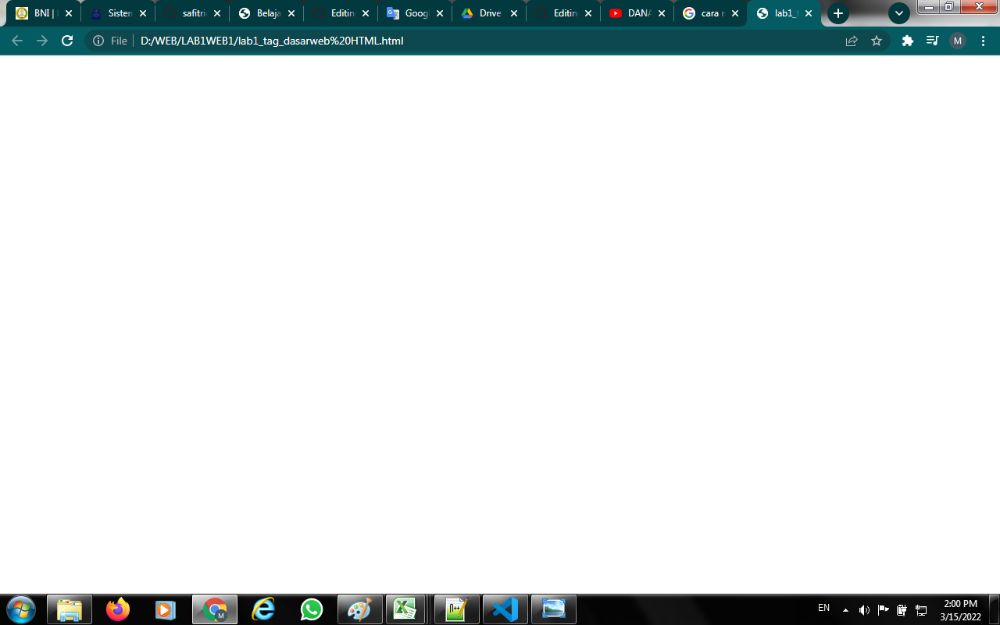
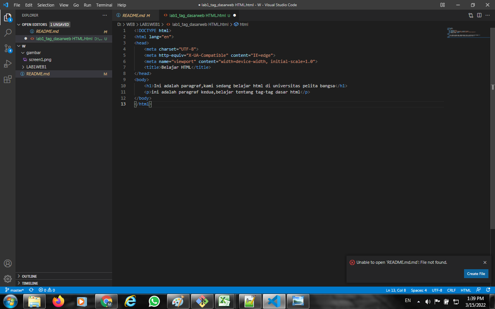
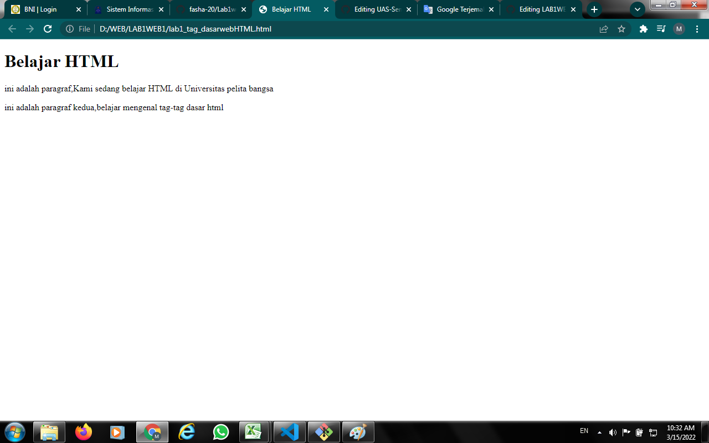
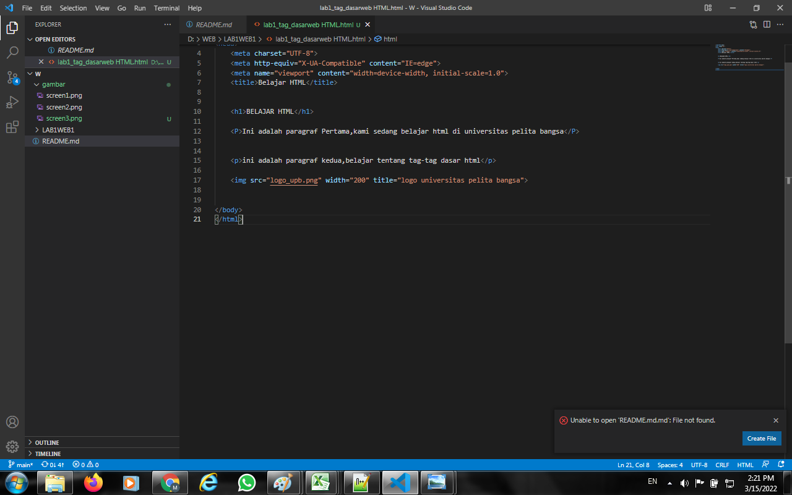

NAMA:MUHAMMAD ILHAM MUBAROK
NIM:312010278
KELAS:TI.20.B2

# LAB1WEB1

Membuat Halaman Web Dasar HTML

1.Memasukan title pada bagian HTML

2.masuk ke visual code beri judul 

Maka akan menampilkan gambar seperti berikut

3.penambahan gambar logo UPB

Maka akan menampilkan gambar seperti berikut

.
